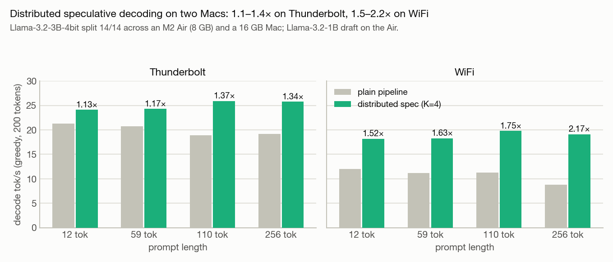
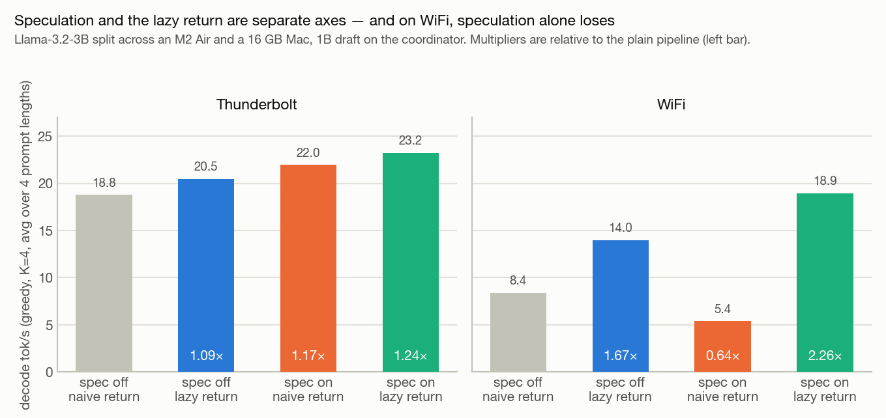
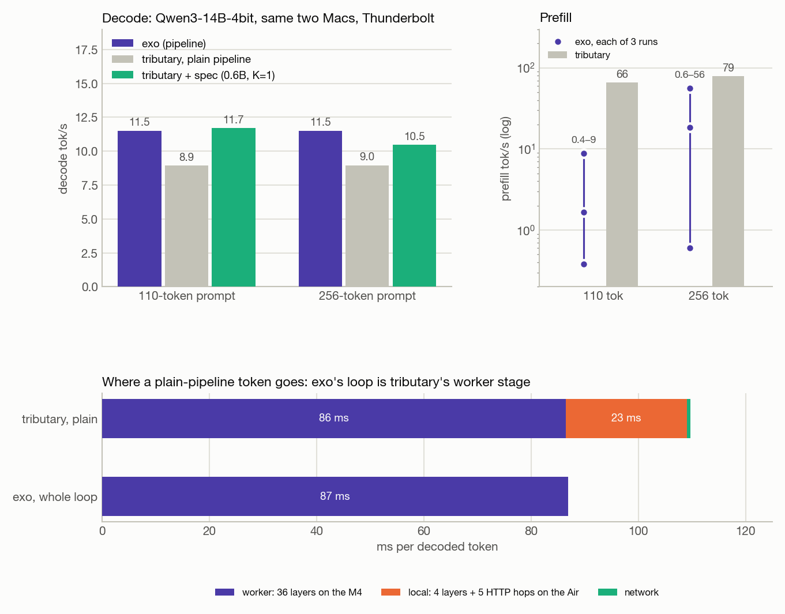

# Tributary

Distributed LLM inference across ordinary Apple Silicon Macs: pipeline parallelism over Thunderbolt or WiFi, plus distributed speculative decoding to make the split pay. Built as a measurement testbed, not a product: every knob is a flag, every run logs per-stage timings, and every number is in [`docs/results.md`](docs/results.md).

**Writeup:** [Tributary: distributed inference and speculative decoding](https://x.com/arjun2garg/status/2103664427413172656)



## Results at a glance

Coordinator: 2023 MacBook Air, M2, 8 GB. Worker: Mac M4, 16 GB. All models are 4-bit `mlx-community` quantizations. Decode tok/s, greedy, steady state.

| what | result |
|---|---|
| Llama-3.2-3B split 14/14, WiFi, K=4 spec + lazy return | **2.25×** over the plain pipeline (speculation alone: 0.64×) |
| Same, Thunderbolt | 1.23× (1.13–1.37× by prompt length) |
| Qwen3-14B vs [exo](https://github.com/exo-explore/exo), same two Macs, Thunderbolt | exo 11.5 · tributary plain 9.0 · **tributary + spec 11.7** (110-tok prompt), 10.5 (256-tok) |
| Mistral-Small-24B (fits on neither Mac alone) | 6.2 tok/s Thunderbolt, 4.9 WiFi |
| Exactness of sampled speculative output | TV distance 0.2–0.5× the direct-sampling noise floor at T = 0.3 / 0.8 / 1.0 |
| Leviathan Eq. 1 replication | α at K=1 predicts tokens/round at K=2..4 within 4%, 3 model pairs |

The central result is that speculation and the lazy return are separate axes, and on WiFi they have opposite sign: speculation with a naive return ships K+1 full distributions back per round and regresses to 0.64×; the lazy return alone is 1.67×; together they are 2.25×.



Against exo on the same two Macs and the same Qwen3-14B weights, tributary's plain pipeline is 28% slower (the gap is localhost HTTP on the coordinator, not the wire), and with speculative decoding it matches exo at 110-token prompts.



## How it works

```
┌─────────────── coordinator (Mac 1) ───────────────┐      ┌────────── worker (Mac 2) ──────────┐
│ tributary (Rust)                                  │      │ tributary --mode worker (Rust)     │
│   generation loop · spec decoding · TCP frames    │◄────►│   TCP frames · timing              │
│      │ localhost HTTP                             │ TCP  │      │ localhost HTTP              │
│ server.py (MLX)  layers 0..N   + draft model      │      │ server.py (MLX)  layers N..end     │
└───────────────────────────────────────────────────┘      └────────────────────────────────────┘
```

- **Rust owns the loop**, Python/MLX owns compute. Each machine runs one MLX server holding a contiguous layer range (`--start-layer/--end-layer`) with its own KV cache; weights load lazily so resident RAM scales with the layers a node actually runs.
- **Between machines:** one persistent TCP connection carrying length-prefixed binary frames (`Prefill`, `DecodeStep`, `Verify`, `Trim`, ...). Activations travel as fp16; small results ride in a `u32` side-channel so a verification reply can be a header with no payload.
- **Speculative decoding:** the draft model runs on the coordinator; the target verifies K+1 tokens in one batched forward across the pipeline; all three KV caches (draft, local shard, worker) roll back by `K − accepted`. Accept/reject is Leviathan et al. 2023, with three exact specializations: argmax-prefix (greedy target), greedy draft (verifier returns two integers), and the full rule with a **two-phase lazy return** (K+1 scalars, then one distribution only at the rejection point).
- `--return-mode naive|lazy` is independent of `--spec-k`, so the bandwidth optimization and speculation can be ablated separately.

## Requirements

- Apple Silicon Macs running macOS; a Thunderbolt bridge or shared WiFi between them.
- Python 3.11 with `mlx`, `mlx-lm`, `fastapi`, `uvicorn` (`pip install -r tributary-mlx/requirements.txt`).
- Rust 1.85 or newer (`cargo build --release` in `tributary-core/`).
- Models download from Hugging Face on first use. Each node downloads the full checkpoint; only its layer range is materialized in RAM.

## Quickstart

**1. Single machine, one model.**

```sh
cd tributary-mlx && python server.py --model mlx-community/Llama-3.2-3B-Instruct-4bit --port 8765
# in another shell
cd tributary-core && cargo run --release -- --mode single --prompt "Explain a KV cache." --max-tokens 100
```

**2. Single machine, speculative decoding.** Start a second server with the draft model on port 8766, then:

```sh
python server.py --model mlx-community/Llama-3.2-1B-Instruct-4bit --port 8766
tributary --mode single --spec-k 4 --draft-model http://localhost:8766 --prompt "..." --temperature 0
```

**3. Two machines.** On the worker (layers 14..28 of the 28-layer 3B):

```sh
python server.py --model mlx-community/Llama-3.2-3B-Instruct-4bit --start-layer 14 --end-layer 28 --port 8765
tributary --mode worker --listen 9000
```

On the coordinator (layers 0..14):

```sh
python server.py --model mlx-community/Llama-3.2-3B-Instruct-4bit --start-layer 0 --end-layer 14 --port 8765
tributary --mode coordinator --worker <worker-ip>:9000 --prompt "..." --timing-csv run.csv
```

**4. Two machines, distributed speculative decoding.** Add the draft server on the coordinator and pass the spec flags:

```sh
tributary --mode coordinator --worker <worker-ip>:9000 --spec-k 4 --draft-model http://localhost:8766 \
          --temperature 0.7 --draft-temp 0 --return-mode lazy --spec-seed 1 --prompt "..."
```

The coordinator validates the split at connect time (contiguous, no overlap, worker owns the tail). Greedy runs are byte-identical to single-node greedy decoding; sampled runs are reproducible per `--spec-seed`.

### Flags

`tributary` (`tributary-core/src/main.rs`):

| flag | default | meaning |
|---|---|---|
| `--mode single\|coordinator\|worker` | `single` | role of this process |
| `--prompt` | | prompt text (tokenized raw, no chat template) |
| `--max-tokens` | 200 | generation cap |
| `--temperature` | 0 | target sampling temperature (0 = greedy) |
| `--mlx-server` | `http://localhost:8765` | local MLX server |
| `--mlx-server-b` | | second local server for a two-process split on one machine |
| `--worker host:port` | | coordinator: the worker's TCP address |
| `--listen port` | | worker: port to accept the coordinator on |
| `--timing-csv path` | | per-token stage timings (local / network / worker / sample, bytes) |
| `--spec-k` | 0 | draft length K (0 = no speculation) |
| `--draft-model url` | | draft model's MLX server |
| `--draft-temp` | 0 | draft sampling temperature (0 = greedy draft, zero-byte return) |
| `--spec-seed` | 0 | base RNG seed for sampled speculation |
| `--return-mode naive\|lazy` | `lazy` | ship full distributions vs the lazy return |

`server.py` (`tributary-mlx/server.py`): `--model`, `--start-layer`, `--end-layer`, `--port` (8765), `--cache-limit-gb` (cap MLX's buffer cache on RAM-tight nodes).

## Benchmarks

Every run prints steady-state tok/s, time to first token, and for speculation: rounds, accepted fraction, tokens per round, bytes returned per round, round-trips per token. Prompts are calibrated to 12 / 59 / 110 / 256 tokens and reused verbatim across experiments so runs line up. The sweeps behind the results, each a section of [`docs/results.md`](docs/results.md):

- **Plain pipeline** on Llama-3.2-3B and Mistral-Small-24B, both transports, per-stage latency and wire sizes ([§2](docs/results.md#2-two-node-pipeline-llama-32-3b), [§3](docs/results.md#3-mistral-small-24b-fits-on-neither-mac)).
- **Single-node speculation** and the exactness gate for sampled output ([§4](docs/results.md#4-single-node-speculative-decoding)).
- **Bytes on the wire** by return scheme, draft temperature vs target temperature, and the break-even for a greedy draft ([§5](docs/results.md#5-what-the-verifier-returns)).
- **Two-machine speculation**, spec off vs K=4, both transports ([§6](docs/results.md#6-two-machine-speculative-decoding-llama-32-3b)).
- **The 2×2 decomposition**: transport × speculation × return mode × K × temperatures, 144 runs ([§7](docs/results.md#7-decomposition-speculation--return-mode)).
- **Qwen3-14B**: the activation-dtype fix and a draft × K sweep ([§8](docs/results.md#8-qwen3-14b)).
- **exo parity**: tributary at exo's own layer split, three repeats ([§9](docs/results.md#9-head-to-head-vs-exo)).
- **Acceptance by MT-Bench domain** and K, three draft/target pairs ([§10](docs/results.md#10-acceptance-vs-the-literature)).

## Correctness gates

- Greedy speculative output is byte-identical to plain greedy decoding (single-node, two-process, two-machine, both transports, all four return-mode cells). Byte identity across varying K doubles as the three-way cache-rollback proof.
- Sampled output is checked against the target's exact next-token distribution by total-variation distance against a direct-sampling noise floor.
- On Qwen3-14B in bfloat16, batched verification and single-token decoding round differently, so greedy byte-identity holds only for a prefix; the guarantee there is "same distribution up to fp rounding."

## Layout

```
tributary-core/src/main.rs        CLI, run modes, generation + speculative loops, worker loop, timing
tributary-core/src/protocol.rs    length-prefixed TCP frame format
tributary-core/src/mlx_client.rs  HTTP client for the local MLX server
tributary-mlx/model.py            PartialModel: layer range, KV cache, draft / verify / accept / resample
tributary-mlx/server.py           FastAPI compute service
docs/results.md                   every measurement, by experiment
docs/figures/                     figures, regenerated from the per-run CSVs
```

## Limitations

Synchronous pipeline (draft and verify alternate; no overlap). One connection per worker, no reconnect, no discovery, no automatic placement: the split is a flag on each node. The coordinator's ~22 ms/token local stage is mostly localhost HTTP to the MLX process, which is the remaining gap to exo on the plain pipeline.

## References

Leviathan, Kalman, Matias, *Fast Inference from Transformers via Speculative Decoding* (ICML 2023) · Chen et al., *Accelerating Large Language Model Decoding with Speculative Sampling* (2023) · [exo](https://github.com/exo-explore/exo) · [MLX](https://github.com/ml-explore/mlx)

## Citation

```bibtex
@misc{garg2026tributary,
  author = {Garg, Arjun},
  title  = {Tributary: distributed speculative decoding across Apple Silicon Macs},
  year   = {2026},
  url    = {https://github.com/arjun2garg/Tributary}
}
```

## License

MIT. See [LICENSE](LICENSE).
