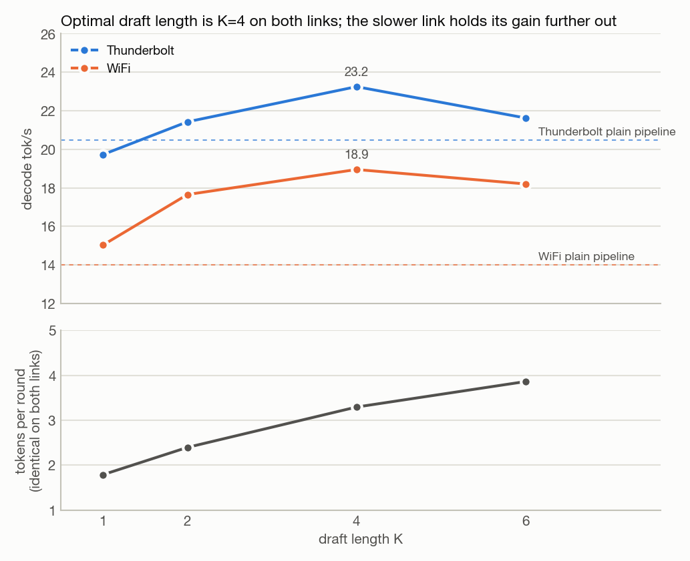
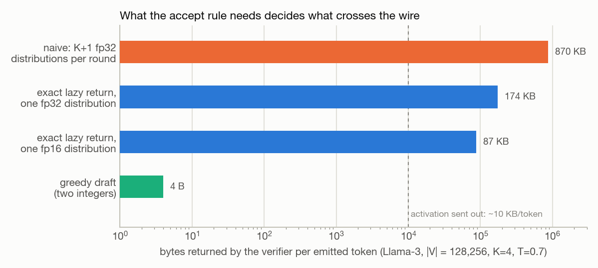
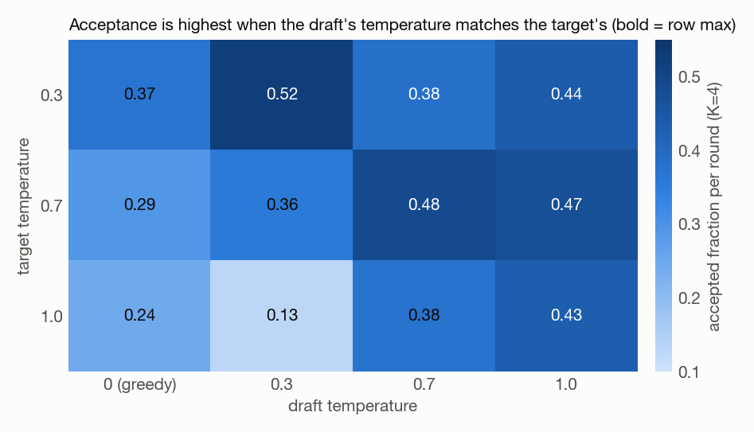
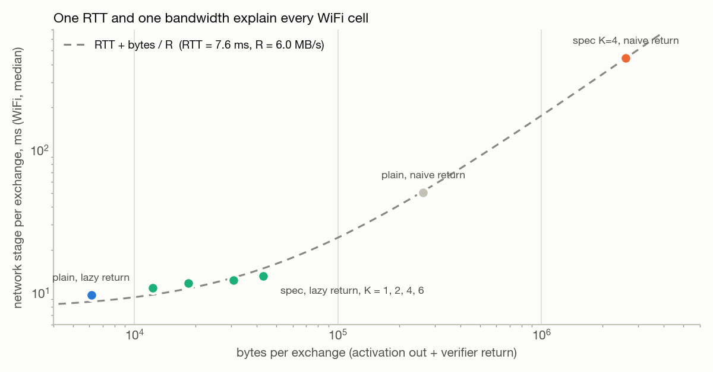
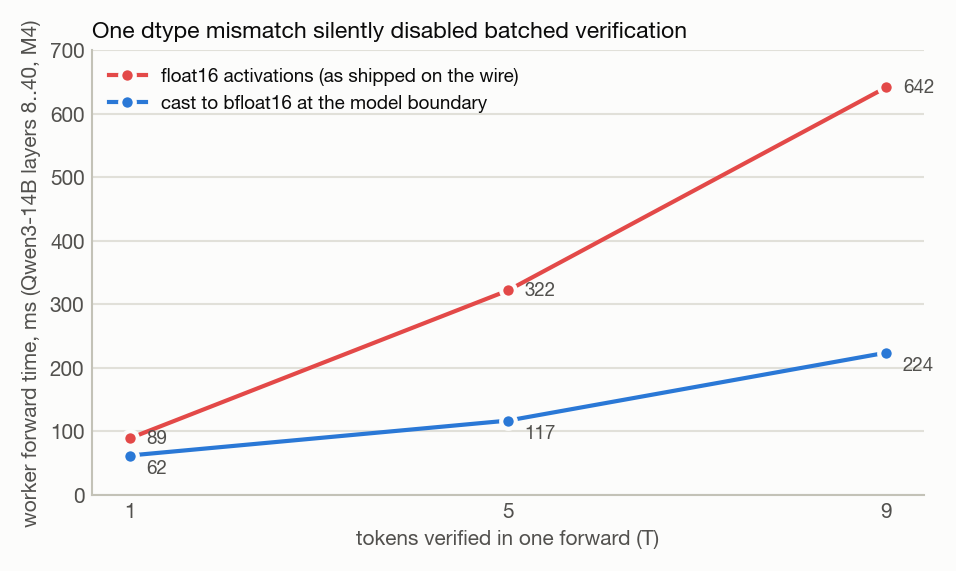
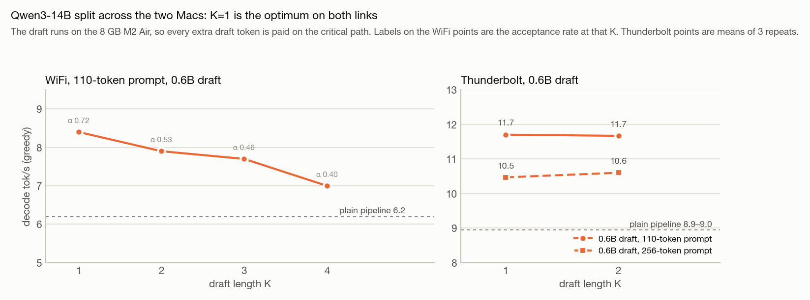
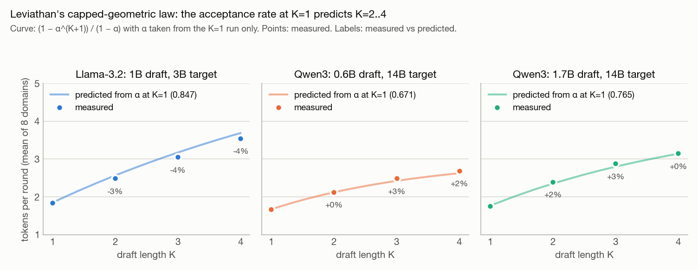
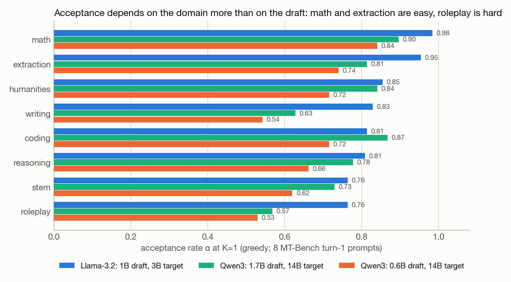

# Benchmark results

Every number below was measured on the two machines in §0. Each section gives the setup, the tables, and a one-line result. Figures are regenerated from the per-run CSVs.

Contents: [0 Hardware and method](#0-hardware-and-method) · [1 Single-node baselines](#1-single-node-baselines) · [2 Two-node pipeline](#2-two-node-pipeline-llama-32-3b) · [3 24B model](#3-mistral-small-24b-fits-on-neither-mac) · [4 Single-node speculation](#4-single-node-speculative-decoding) · [5 What the verifier returns](#5-what-the-verifier-returns) · [6 Two-machine speculation](#6-two-machine-speculative-decoding-llama-32-3b) · [7 Decomposition](#7-decomposition-speculation--return-mode) · [8 Qwen3-14B](#8-qwen3-14b) · [9 exo head-to-head](#9-head-to-head-vs-exo) · [10 Acceptance vs literature](#10-acceptance-vs-the-literature) · [Correctness](#correctness)

---

## 0. Hardware and method

| Role | Machine | RAM |
|---|---|---:|
| Coordinator | 2023 MacBook Air, M2 | 8 GB |
| Worker | Mac, M4 | 16 GB |

Links: a Thunderbolt bridge (network stage 0.6–0.9 ms/token) and shared WiFi (18–50 ms/token). Software: Python 3.11, `mlx` / `mlx-lm`, Rust; exo at commit `21a54c5` on stock MLX 0.32.0. All models are 4-bit `mlx-community` quantizations.

- **Prompts** are calibrated to 12 / 59 / 110 / 256 tokens (p12 … p256) and reused verbatim across experiments.
- **tok/s** is steady-state decode: generated tokens over the time from the first token to the last. Prefill is excluded and reported as time-to-first-token (ttft).
- **Greedy** (temperature 0) unless stated. Sampled runs are seeded and reproducible per seed.
- **α** as logged is `accepted / (rounds · K)`, the accepted fraction per round. It equals Leviathan's per-token acceptance probability only at K=1; tables say which is meant.
- **Stages**: `local` is coordinator compute (draft + local shard), `network` is time on the wire, `worker` is remote compute. Medians unless stated, per token for the plain pipeline and per round for speculation.

---

## 1. Single-node baselines

**Setup.** Llama-3.2-3B-Instruct-4bit on the M2 Air alone, greedy, 100 generated tokens. July 2026.

KV cache on vs off, by prompt length:

| Prompt tokens | No cache (tok/s) | Cached (tok/s) | Speedup |
|--:|--:|--:|--:|
| 10 | 6.8 | 39.0 | 5.7× |
| 50 | 3.3 | 39.1 | 11.7× |
| 100 | 2.1 | 27.6 | 13.1× |
| 250 | 0.6 | 28.4 | 44.9× |

Generation loop in Python (in-process) vs in Rust (five localhost HTTP calls per token):

| Prompt tokens | Python loop (tok/s) | Rust loop (tok/s) | Δ per token |
|--:|--:|--:|--:|
| 11 | 38.6 | 34.6 | ~3.0 ms |
| 54 | 37.9 | 34.4 | ~2.7 ms |
| 108 | 38.1 | 34.3 | ~2.9 ms |
| 270 | 38.7 | 32.6 | ~4.8 ms |

Layers split across two MLX processes on the same machine (0–14 / 14–28):

| Run | Tokens | Two-process split (tok/s) | Single process (tok/s) |
|---|--:|--:|--:|
| p250 prompt, 100 generated | 100 | 25.6 | ~33 |
| Short prompt, EOS at 78 | 78 | 22.8 | 33.0 |

**Result.** The Rust loop costs 3–5 ms/token of localhost HTTP; splitting layers across two processes on one machine costs ~25% because the two stages run serially and contend for one GPU.

---

## 2. Two-node pipeline, Llama-3.2-3B

**Setup.** Llama-3.2-3B-Instruct-4bit, coordinator layers 0–14, worker layers 14–28 + lm_head. Greedy, 200 generated tokens, one warm-up discarded. August 17, 2026.

| Prompt tokens | Thunderbolt (tok/s) | WiFi (tok/s) | ttft TB (s) | ttft WiFi (s) |
|--:|--:|--:|--:|--:|
| 12 | 20.9 | 11.2 | 0.13 | 0.24 |
| 59 | 21.2 | 11.3 | 0.25 | 0.38 |
| 110 | 21.1 | 11.3 | 0.35 | 0.52 |
| 256 | 21.2 | 11.4 | 0.72 | 0.98 |

Per-token decode latency (median, ms):

| Transport | local | network | worker | round-trip | sample |
|---|--:|--:|--:|--:|--:|
| Thunderbolt | 19.4 | 0.77 | 22.6 | 23.4 | 2.0 |
| WiFi | 21.0 | 29.8 | 22.1 | 52.5 | 2.6 |

Wire sizes (measured):

| Transfer | Bytes |
|---|--:|
| Decode activation, 1 token, coordinator → worker | 6,144 |
| Logits, 1 position, worker → coordinator | 256,512 |
| Prefill activation, 256-token prompt | 1,572,864 |

**Result.** Thunderbolt is 1.9× WiFi and the entire difference is the network stage, dominated by the 256 KB logits returned per token. Even on Thunderbolt the two-node pipeline (21 tok/s) is slower than one machine (33 tok/s) because the two stages run strictly serially.

---

## 3. Mistral-Small-24B (fits on neither Mac)

**Setup.** Mistral-Small-24B-Instruct-2501-4bit, 13.3 GB, 40 layers. Coordinator layers 0–10, worker 10–40. Greedy, 100 generated tokens. Weights load lazily so each node materializes only its layer range. August 17–18, 2026.

Choosing the split:

| Split (coord / worker) | Coordinator RAM | Worker RAM | Outcome |
|---|--:|--:|---|
| 12 / 28 | 4.14 GB | ~9.2 GB | coordinator swaps → ~0.03 tok/s |
| 8 / 32 | 2.92 GB | 10.45 GB | worker swaps → 1.9 tok/s |
| **10 / 30** | **3.53 GB** | **~9.8 GB** | both stable → 6.2 tok/s |

Throughput at 10/30. `steady` excludes the post-prefill transient; `raw` includes it.

| Prompt tokens | TB steady | TB raw | WiFi steady | WiFi raw | ttft TB / WiFi (s) |
|--:|--:|--:|--:|--:|--:|
| 12 | 6.3 | 6.3 | 5.0 | 5.0 | 0.6 / 0.9 |
| 59 | 6.2 | 5.7 | 4.8 | 4.6 | 1.3 / 1.7 |
| 110 | 6.3 | 5.7 | 4.9 | 4.3 | 3.3 / 3.2 |
| 256 | 6.2 | 1.2 | 4.9 | 1.2 | 5.3 / 6.3 |

Per-token decode latency (median, steady state, ms):

| local (10 layers) | worker (30 layers + lm_head) | network | round-trip | sample |
|--:|--:|--:|--:|--:|
| 42 | 109 | TB 1 / WiFi 26 | TB 110 / WiFi 137 | 3 |

**Result.** A model that loads on neither machine alone runs at 6.2 tok/s over Thunderbolt and 4.9 over WiFi; resident RAM scales with the layers a node runs.

**Caveat.** The p256 raw collapse is three decode tokens stalling 12–30 s each while the 8 GB coordinator pages after the large prefill (about 69 of 83 s); steady state is unaffected.

---

## 4. Single-node speculative decoding

**Setup.** Draft Llama-3.2-1B-Instruct-4bit, target Llama-3.2-3B-Instruct-4bit, both on the M2 Air. Greedy draft and target, 128-token cap, one prompt. August 20, 2026.

| K | α (accepted fraction) | accepted / verify | tok/s | vs baseline | draft ms/round | verify ms/round |
|--:|--:|--:|--:|--:|--:|--:|
| 0 (baseline) | — | 1.00 | **35.4** | 1.00× | — | — |
| 1 | 0.806 | 1.77 | 32.1 | 0.91× | 24.5 | 28.5 |
| 2 | 0.739 | 2.39 | 33.4 | 0.94× | 29.4 | 39.5 |
| 4 | 0.641 | 3.44 | 29.5 | 0.83× | 50.0 | 62.4 |
| 6 | 0.456 | 3.67 | 21.8 | 0.62× | 71.1 | 92.4 |

Exactness of sampled output. The empirical distribution of the first emitted token over N speculative rounds is compared to the target's exact distribution p\* by total-variation distance, against the expected TV of N direct draws from p\*.

| T | N | TV(spec, p\*) | Noise floor | Ratio |
|--:|--:|--:|--:|--:|
| 0.3 | 400 | 0.0052 | 0.0245 | 0.21 |
| 0.8 | 400 | 0.0216 | 0.0421 | 0.51 |
| 1.0 | 700 | 0.0267 | 0.0507 | 0.53 |

α across five seeds at T=0.8, K=4: 0.44, 0.49, 0.54, 0.63, 0.49.

**Result.** On one machine speculation is a net loss (0.83× at K=4): a 3B-4bit forward is already fast on the Air, so the K verify tokens cost real time and the 1B draft is pure overhead. Sampled output matches the target distribution to within sampling noise.

---

## 5. What the verifier returns

**Setup.** Same 1B → 3B pair on one machine, K=4, seeded. Measured bytes returned by the verifier per round: **8 B** with a greedy draft (accepted count + final token) vs **2,565,120 B** with a sampled draft and a naive return (K+1 fp32 distributions over a 128,256-token vocabulary). August 23, 2026.

Per emitted token, dividing by the measured tokens per round:

| Target T | Tokens / round | Naive, K+1 fp32 | Lazy, 1 fp32 | Lazy, 1 fp16 | Greedy draft |
|--:|--:|--:|--:|--:|--:|
| 0.3 | 2.97 | 843 KB | 169 KB | 84 KB | ~3 B |
| 0.7 | 2.88 | 870 KB | 174 KB | 87 KB | ~4 B |
| 1.0 | 2.71 | 924 KB | 185 KB | 92 KB | ~4 B |

One distribution, by vocabulary size:

| Model family | Vocab | fp16 | fp32 |
|---|--:|--:|--:|
| Llama-2 / Mistral-7B | 32,000 | 62 KB | 125 KB |
| GPT-2 / Pythia | ~50,300 | 98 KB | 196 KB |
| Llama-3.x | 128,256 | 250 KB | 501 KB |
| Mistral-Small-24B | 131,072 | 256 KB | 512 KB |
| Qwen2.5 | 151,936 | 297 KB | 594 KB |
| Gemma-2/3 | 256,000 | 500 KB | 1000 KB |

Acceptance vs draft temperature (α / accepted per round, K=4, one prompt, seed 1; bold = row maximum):

| Target T \ Draft T | 0 (greedy) | 0.3 | 0.7 | 1.0 |
|--:|:--|:--|:--|:--|
| 0.3 | 0.372 / 2.44 | **0.523 / 2.97** | 0.382 / 2.50 | 0.436 / 2.71 |
| 0.7 | 0.290 / 2.16 | 0.356 / 2.38 | **0.485 / 2.88** | 0.470 / 2.88 |
| 1.0 | 0.245 / 1.98 | 0.129 / 1.48 | 0.375 / 2.50 | **0.429 / 2.71** |

α gap, temperature-matched draft minus greedy draft (5 prompts × 3 seeds):

| Target T | Mean gap | Std | Min | Max |
|--:|--:|--:|--:|--:|
| 0.3 | −0.018 | 0.100 | −0.200 | 0.151 |
| 0.7 | +0.134 | 0.151 | −0.093 | 0.345 |
| 1.0 | +0.257 | 0.171 | −0.032 | 0.626 |
| all | +0.124 | 0.183 | −0.200 | 0.626 |

By prompt type (mean over seeds and temperatures): repetitive +0.059, reasoning +0.068, factual +0.146, prose +0.162, code +0.185.

Single-machine throughput, greedy draft vs temperature-matched draft (tok/s):

| Target T | Greedy draft | Matched draft |
|--:|--:|--:|
| 0.3 | 20.6 | 23.9 |
| 0.7 | 18.3 | 23.6 |
| 1.0 | 16.6 | 22.0 |

Break-even: the α drop a greedy draft may give up and still beat a lazy return of one distribution, `Δα_max = ΔR / (C + R_L) · (α_L + 1/K)`, with measured C ≈ 117 ms/round, α_L ≈ 0.5, K=4:

| Link, return dtype | ΔR | Δα_max |
|---|--:|--:|
| localhost / Thunderbolt | 0.5–2 ms | 0.003–0.013 |
| WiFi, fp16 | 28 ms | 0.145 |
| WiFi, fp32 (exact) | 56 ms | 0.243 |

**Result.** A greedy draft removes the return payload entirely at a cost in acceptance that is near zero at low temperature and ~0.26 at T=1.0. On one machine that trade loses; on WiFi the tolerable α drop (0.24 vs fp32) exceeds the observed drop, so it wins. Acceptance is maximized when the draft's temperature matches the target's.

---

## 6. Two-machine speculative decoding, Llama-3.2-3B

**Setup.** Draft Llama-3.2-1B-4bit on the coordinator; target Llama-3.2-3B-4bit split coordinator 0–14 / worker 14–28. Greedy draft and target, K=4, 200 generated tokens, one warm-up discarded. Spec-off baseline is the plain pipeline on the same servers in the same session. August 23, 2026.

| Prompt tokens | TB off | **TB spec** | TB × | WiFi off | **WiFi spec** | WiFi × | α | accepted / verify |
|--:|--:|--:|--:|--:|--:|--:|--:|--:|
| 12 | 21.3 | **24.1** | 1.13 | 12.0 | **18.2** | 1.52 | 0.544 | 3.16 |
| 59 | 20.7 | **24.3** | 1.17 | 11.2 | **18.3** | 1.63 | 0.544 | 3.16 |
| 110 | 18.9 | **25.9** | 1.37 | 11.3 | **19.8** | 1.75 | 0.616 | 3.43 |
| 256 | 19.2 | **25.8** | 1.34 | 8.8 | **19.1** | 2.17 | 0.608 | 3.43 |

Round-trips per emitted token: 0.29–0.32 (vs 1.0 for the plain pipeline). Verifier return: 20 B/round (vs 256 KB/token).

Per-stage medians at p256 (spec rows are per round ≈ 3.43 emitted tokens):

| Case | local | network | worker | round-trip |
|---|--:|--:|--:|--:|
| WiFi off (per token) | 23.9 ms | 44.3 ms | 22.6 ms | 68.3 ms |
| WiFi spec (per round) | 87.5 ms | 12.8 ms | 45.4 ms | 57.4 ms |
| TB off (per token) | 23.0 ms | 0.87 ms | 22.7 ms | 23.6 ms |
| TB spec (per round) | 86.0 ms | 0.75 ms | 39.8 ms | 40.6 ms |

**Result.** 1.13–1.37× on Thunderbolt and 1.52–2.17× on WiFi. The draft compute that made speculation a loss on one machine (~50 ms/round in `local`) is amortized over 3.4 tokens and hidden behind the round-trips it removes; the WiFi network stage drops from 44 ms/token to ~3.7 ms/token.

---

## 7. Decomposition: speculation × return mode

**Setup.** Same Llama pair and split. `--return-mode naive|lazy` is independent of `--spec-k`, giving four cells: **A** spec off + naive return (worker ships the full 256 KB distribution per token), **B** spec off + lazy return (worker samples, returns the token id), **C** spec on + naive return (worker ships K+1 distributions per round), **D** spec on + lazy return (20 B per round). Greedy, K=4, averaged over the four prompt lengths. 144 runs, 0 failures. August 23, 2026.

| | Naive return | Lazy return |
|---|--:|--:|
| **Thunderbolt**, spec off | 18.8 (A) | 20.5 (B) |
| **Thunderbolt**, spec on | 22.0 (C) | 23.2 (D) |
| **WiFi**, spec off | 8.4 (A) | 14.0 (B) |
| **WiFi**, spec on | **5.4 (C)** | **18.9 (D)** |

Return payload: A 256 KB/token · B 4 B/token · C 2,565,120 B/round · D 20 B/round.

| Effect (vs A) | Thunderbolt | WiFi |
|---|--:|--:|
| Lazy return alone (B/A) | 1.09× | **1.67×** |
| Speculation alone (C/A) | 1.17× | **0.64×** |
| Both (D/A) | **1.23×** | **2.25×** |

Network stage per cell (WiFi, p256, median):

| Cell | Network | Unit |
|---|--:|---|
| A off, naive | 31.7 ms | per token |
| B off, lazy | 9.3 ms | per token |
| C on, naive | **323.3 ms** | per round |
| D on, lazy | 11.9 ms | per round |

K sweep with the lazy return (greedy, averaged over prompts):

| K | TB tok/s | WiFi tok/s | α (accepted fraction) | round-trips / token |
|--:|--:|--:|--:|--:|
| 1 | 19.7 | 15.0 | 0.792 | 0.559 |
| 2 | 21.4 | 17.6 | 0.700 | 0.418 |
| 4 | **23.2** | **18.9** | 0.578 | 0.304 |
| 6 | 21.6 | 18.2 | 0.481 | 0.261 |

Sampled target at T=0.7, K=4, lazy return, greedy draft vs temperature-matched draft:

| Draft temperature | α | TB tok/s | WiFi tok/s | Return |
|--:|--:|--:|--:|---|
| 0 (greedy) | 0.448 | 18.9 | **15.6** | ~8 B/round |
| 0.7 (matched) | 0.496 | 18.3 | 11.3 | one 513 KB distribution/round |

**Result.** On WiFi the two axes have opposite sign: speculation with a naive return is a 0.64× regression (2.5 MB back per round costs 323 ms) and the lazy return alone is 1.67×; together they give 2.25×. On Thunderbolt the return is nearly free, so speculation is the lever (1.17×) and the lazy return adds 1.09×. K=4 is optimal on both links; the gain from larger K holds further out on the slower link.

---

## 8. Qwen3-14B

**Setup.** Target Qwen3-14B-4bit (40 layers), coordinator 0–8 / worker 8–40. Draft on the coordinator. Greedy, WiFi. August 27, 2026.

### 8a. Activation dtype on the wire

Qwen3 computes in bfloat16; activations were serialized as float16. A float16 input to a bfloat16 quantized matmul takes an unbatched per-row path, so a T-token verify cost about T single forwards. The fix casts incoming activations to the model's compute dtype at the shard boundary.

Worker shard 8–40, 256-token context, one forward of T tokens (ms):

| T | bf16 input | f16 input (wire, before fix) | f16 → cast to bf16 (after fix) |
|--:|--:|--:|--:|
| 1 | 64 | 89 | 62 |
| 5 | 117 | 322 | 117 |
| 9 | 224 | **642** | 224 |

End to end, 100 generated tokens, WiFi:

| Case | Before fix (tok/s) | After fix (tok/s) | Worker per round, before → after |
|---|--:|--:|--:|
| Plain pipeline | 5.7 | **7.0** | 108 → 82 ms |
| Spec 1.7B draft, K=2 (α 0.43) | 4.8 | **6.9** | 217 → 113 ms |
| Spec 1.7B draft, K=4 (α 0.29) | 3.6 | **6.1** | 367 → 163 ms |

Verify cost on the M4 after the fix, T = 1 / 5 / 9 / 16 / 32 / 48 tokens: 65 / 124 / 240 / 309 / 313 / 615 ms (a plateau from T=16 to 32).

Per-stage means after the fix (WiFi, ms; spec rows per round):

| Stage | Plain, per token | Spec 1.7B K=2, per round | Spec 1.7B K=4, per round |
|---|--:|--:|--:|
| draft + coordinator shard | 31.7 | 98.3 | 151.4 |
| network | 18.5 | 37.7 | 28.5 |
| worker | 79.0 | 112.3 | 163.2 |
| **total** | **129** | **248** | **343** |
| accepted / round | 1.0 | 1.87 | 2.15 |
| **per emitted token** | **129 ms → 7.7 tok/s** | **133 ms → 7.5** | **160 ms → 6.3** |

**Result.** The cast made the whole system 1.2–1.7× faster. With the 1.7B draft speculation then ties the plain pipeline (7.5 vs 7.7 tok/s): verify is no longer the constraint, acceptance (α 0.43) and draft cost on the 8 GB coordinator are.

**Caveat.** After the fix, batched verify (gemm) and single-token decode (gemv) round differently in bf16, so greedy spec-on and spec-off transcripts share a long prefix and then diverge on a near-tie argmax. See [Correctness](#correctness).

### 8b. Draft sweep

**Setup.** Same split, WiFi, greedy, 150 generated tokens, drafts Qwen3-0.6B-4bit and Qwen3-1.7B-4bit, K ∈ {1, 2, 3, 4}, one run per cell.

| Draft | K | p110 tok/s | p256 tok/s | α (p110 / p256) | accepted / round (p110) | local ms/round | worker ms/round |
|---|--:|--:|--:|:--|--:|--:|--:|
| none (baseline) | 0 | 6.2 | 6.0 | — | 1.00 | 37 | 87 |
| 0.6B | **1** | **8.4** | **7.2** | 0.72 / 0.59 | 1.71 | 64 | 98 |
| 0.6B | 2 | 7.9 | 7.7 | 0.53 / 0.51 | 2.04 | 91 | 116 |
| 0.6B | 3 | 7.7 | 6.8 | 0.46 / 0.41 | 2.37 | 113 | 148 |
| 0.6B | 4 | 7.0 | 6.3 | 0.40 / 0.37 | 2.61 | 136 | 178 |
| 1.7B | 1 | 7.1 | — | 0.73 / — | 1.73 | 83 | 98 |
| 1.7B | 2 | 7.5 | 7.2 | 0.63 / 0.55 | 2.26 | 120 | 111 |
| 1.7B | 3 | 7.4 | — | 0.52 / — | 2.57 | 142 | 139 |
| 1.7B | 4 | — | — | — | — | — | — |

**Result.** The 0.6B draft at K=1 is 1.35× (p110) and 1.20× (p256) over the plain pipeline. The 1.7B draft accepts no more at K=1 (α 0.73 vs 0.72) but costs 19 ms/round more on the Air, so the cheaper draft wins. K=1 is optimal: from K=1 to 4 accepted tokens per round rise 1.71 → 2.61 while the round cost rises 134 → 231 ms.

**Caveat.** Four 1.7B cells (marked —) were lost to WiFi timeouts and are reported as absent. Per-stage means undercount the measured per-token time here by WiFi tail latency; use the tok/s columns for speedups.

---

## 9. Head-to-head vs exo

**Setup.** [exo](https://github.com/exo-explore/exo) at commit `21a54c5`, run on stock MLX 0.32.0 with the same `mlx-community/Qwen3-14B-4bit` safetensors on the same two Macs over the Thunderbolt bridge. exo's automatic placement put the Air last and swapped it, so the run uses a hand-built placement, M4 layers 0–36 / Air 36–40 + lm_head. Two exo liveness timeouts were raised from 30 s to 600 s (failure detection only). Numbers are from exo's own benchmark harness: 128 generated tokens, greedy, cold KV cache, 2 warm-ups, 3 repeats. tributary runs use the same split reversed (Air 0–4 / M4 4–40), 128 tokens, 3 repeats. September 4, 2026.

exo, measured:

| Prompt tokens | Run | Prefill tok/s | Decode tok/s |
|--:|--:|--:|--:|
| 110 | 1 | 8.8 | 11.3 |
| 110 | 2 | 1.7 | 11.5 |
| 110 | 3 | 0.4 | 11.4 |
| 256 | 1 | 18.3 | 11.4 |
| 256 | 2 | 55.9 | 11.4 |
| 256 | 3 | 0.6 | 11.5 |

tributary at the matched split (Air 0–4 / M4 4–40); ranges are min–max over 3 repeats:

| Config | p110 tok/s | p256 tok/s | α (p110 / p256) | ttft p110 / p256 | local | network | worker |
|---|--:|--:|:--|:--|--:|--:|--:|
| Plain pipeline | 8.9–9.0 | 8.9–9.0 | — | 1.66 s / 3.26 s | 22.6 ms | **0.6 ms** | 86.3 ms |
| Spec 0.6B, K=1 | **11.6–11.8** | **10.4–10.5** | 0.76 / 0.57 | 1.70 s / 3.30 s | 51 ms/round | 0.6 ms | 92 ms/round |
| Spec 0.6B, K=2 | 11.6–11.7 | 10.6 | 0.58 / 0.48 | 1.70 s / 3.29 s | 68 ms/round | 0.7 ms | 111 ms/round |

tributary at its own 8/32 split, same protocol:

| Config | p110 tok/s | p256 tok/s | local | worker |
|---|--:|--:|--:|--:|
| Plain pipeline | 8.8–9.1 | 9.0–9.1 | 27–29 ms | 80 ms |
| Spec 0.6B, K=1 | 11.3–11.8 | 10.3–10.4 | 60 ms/round | 85 ms/round |
| Spec 0.6B, K=2 | 10.1–10.2 | 9.2–9.4 | 90 ms/round | 114 ms/round |

Comparison:

| System (Thunderbolt, Qwen3-14B-4bit, 128 tokens) | p110 decode tok/s | p256 decode tok/s | Prefill |
|---|--:|--:|---|
| **exo**, pipeline, M4 0–36 / Air 36–40 | 11.5 | 11.5 | 0.4–56 tok/s, bimodal |
| **tributary**, plain pipeline, same split | 9.0 | 9.0 | 66 / 79 tok/s |
| **tributary + spec** (0.6B draft, K=1) | **11.7** | **10.5** | 66 / 79 tok/s |

**Result.** On the plain pipeline exo is 28% faster (11.5 vs 9.0 tok/s). tributary's worker stage is 86 ms/token for the M4's 36 layers and exo's whole loop is 87 ms/token, so the gap is the Air's 22 ms local stage, of which ~4 ms is compute for four layers and the rest is five localhost HTTP hops per token. With speculative decoding tributary matches exo at p110 (11.7 vs 11.5) and is 9% behind at p256, where the 0.6B draft's acceptance falls to 0.57. On prefill tributary is ahead (66–79 vs 0.4–56 tok/s). The split does not matter on Thunderbolt: 4/36 and 8/32 give the same plain-pipeline number.

**Caveat.** exo's prefill is bimodal because its last-rank runner on the 8 GB node loses its weight pages between requests; it should not be read as exo's prefill capability on adequate hardware. Single-node exo on the M4 loaded but did not complete a measured request, so there is no exo single-node reference. exo bans EOS and feeds synthetic token ids; tributary runs real text.

---

## 10. Acceptance vs the literature

**Setup.** One MT-Bench turn-1 prompt per category (writing, roleplay, reasoning, math, coding, stem, humanities, extraction), greedy, 128 generated tokens, K ∈ {1, 2, 3, 4}. Llama pair on the M2 Air alone; Qwen pairs on the 14B split 0–8 / 8–40 with the draft on the Air (α is transport-independent). August 28, 2026.

Tokens per round, measured vs predicted by Leviathan Eq. 1, `E[tokens/round] = (1 − α^(K+1)) / (1 − α)`, with α taken only from the K=1 run:

| Pair | K | Logged α (accepted fraction) | τ measured | τ predicted from K=1 α | Error |
|---|--:|--:|--:|--:|--:|
| Llama-3.2-1B → 3B | 1 | **0.847** | 1.84 | — | — |
| | 2 | 0.753 | 2.49 | 2.57 | −3% |
| | 3 | 0.702 | 3.05 | 3.17 | −4% |
| | 4 | 0.651 | 3.55 | 3.69 | −4% |
| Qwen3-0.6B → 14B | 1 | **0.671** | 1.67 | — | — |
| | 2 | 0.568 | 2.13 | 2.12 | +0% |
| | 3 | 0.500 | 2.49 | 2.42 | +3% |
| | 4 | 0.426 | 2.69 | 2.63 | +2% |
| Qwen3-1.7B → 14B | 1 | **0.765** | 1.76 | — | — |
| | 2 | 0.701 | 2.40 | 2.35 | +2% |
| | 3 | 0.630 | 2.88 | 2.80 | +3% |
| | 4 | 0.543 | 3.15 | 3.14 | +0% |

Per-domain α at K=1 (Leviathan's α):

| Category | Llama 1B → 3B | Qwen 1.7B → 14B | Qwen 0.6B → 14B |
|---|--:|--:|--:|
| math | **0.984** | **0.896** | **0.841** |
| extraction | 0.954 | 0.813 | 0.740 |
| humanities | 0.855 | 0.841 | 0.716 |
| writing | 0.829 | 0.628 | 0.542 |
| coding | 0.814 | 0.868 | 0.716 |
| reasoning | 0.809 | 0.778 | 0.662 |
| stem | 0.764 | 0.730 | 0.620 |
| roleplay | 0.764 | 0.568 | 0.530 |
| **mean** | **0.847** | **0.765** | **0.671** |

Draft size vs throughput, Qwen pairs in the same runs: the 1.7B draft accepts more at every K (0.765 vs 0.671 at K=1) and emits fewer tokens per second at every K (12.4 vs 13.4 tok/s at K=1, 10.0 vs 10.7 at K=4).

**Result.** One number measured at K=1 predicts tokens per round at K=2, 3, 4 within 4% for all three pairs. All three pairs sit in or above Leviathan's reported α band of 0.53–0.82. Domain ordering is stable across pairs: math and extraction are easiest, roleplay and open-ended writing hardest. A larger draft raises α and lowers throughput.

**Caveat.** One prompt per category, one run per cell. The per-domain numbers are indicative.

---

## Correctness

- **Greedy byte-identity (Llama-3.2-3B).** Speculative output at temperature 0 is byte-identical to plain greedy decoding on one machine, across two processes, across two machines on both transports, and across all four cells of the 2×2. Identity across varying K, and hence varying accept counts, is also the proof that the three KV caches (draft, local shard, worker) roll back consistently.
- **Sampled exactness.** The first emitted token's distribution matches the target's exact distribution to within the direct-sampling noise floor (§4 table). The greedy-draft path was checked the same way: z-scores against the noise floor of 0.60 (T=0.3, N=800), 0.39 (T=0.8, N=2000), 1.70 (T=1.0, N=800).
- **Reproducibility.** Same `--spec-seed` gives a byte-identical transcript; every exo-parity configuration was byte-identical across its three repeats.
- **Qwen3-14B in bfloat16.** Batched verification and single-token decoding round differently, so greedy spec-on and spec-off transcripts agree on a long prefix and then diverge on a near-tie argmax. On this model the guarantee is the standard one for speculative decoding: the same distribution up to floating-point rounding.
